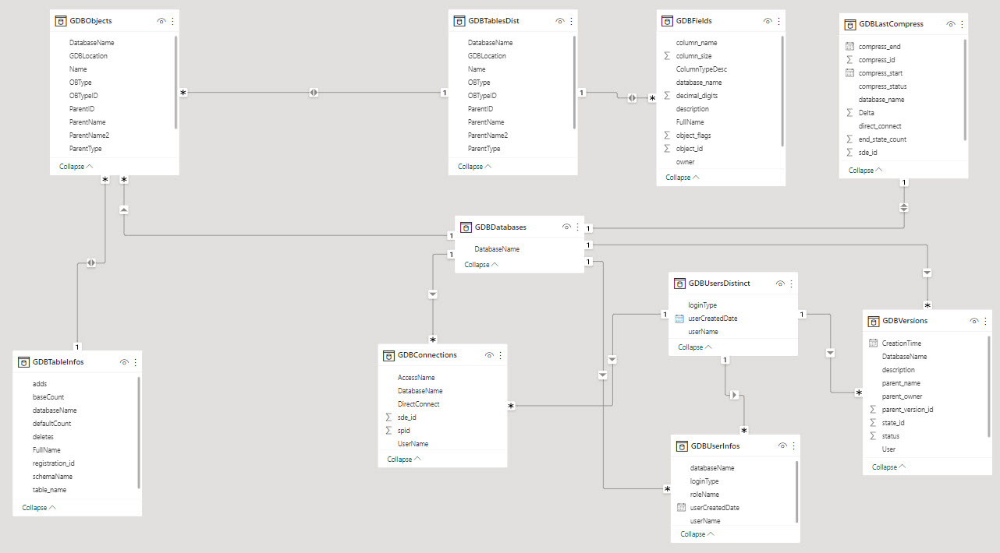

# geodatabaseAdminSQL

These SQL scripts are used to create a series of stored proceduces to monitor geodatabases.
By utilizing these scripts a user will be able to monitor the following:


* Geodatabase users
* Geodatabase user connections
* Geodatabase verions (traditional versioning)
* Geodatabase compress records
* Geodatabase objects (feature classes, tables, datasets, relationships, domains, etc.)
* Geodatabase tables info (feature classes, tables)
* Geodatabase delta info (delta tables, adds, deletes, inserts)
* Geodatabase fields
* Geodatabase orphaned records

## Getting Started

These script were created on a 2016 Microsoft SQL Sever and ESRI's 10.6.1 geodatabase.

Determine which schema your geodatabases are configured in. This will typically be sde or dbo schemas. 

## Installing

Recommended:
	Set up an admin geodatabase where you can create views, tables, and stored procedures to monitor other geodatabases. 

1. Within each SQL script the `USE --[Admin Database]` or `USE Database` lines will need to be updated to reflect the appropriate database. 

2. Within each SQL script (except `dbo.GDBDeltaInfo.StoredProcedure.sql`), if a database needs to be excluded from the iteration then modify the `'IF ''?'' NOT IN('''') BEGIN USE ? ` line to include the database(s) like so `'IF ''?'' NOT IN(''[Database]'') BEGIN USE ? `.

3. Within each geodatabase execute the `dbo.GDBDeltaInfo.StoredProcedure.sql`
	- This will look at the adds, deletes, and insert tables and compile a table organizing everything. 
4. Within the admin database execute all other sql sqripts:
```
    📝dbo.GDBConnections.StoredProcedure.sql
    📝dbo.GDBFields.StoredProcedure.sql
    📝dbo.GDBLatestCompress.StoredProcedure.sql
    📝dbo.GDBObjects.StoredProcedure.sql
    📝dbo.GDBOrphanedRecords.StoredProcedure.sql
    📝dbo.GDBTableInfos.StoredProcedure.sql
    📝dbo.GDBUserInfos.StoredProcedure.sql
    📝dbo.GDBVersions.StoredProcedure.sql
```

## Executing/Running

Executing each stored procedure is as simple as typing the following in SQL Server Management Studio (or any other sql query interface):

```sql
EXEC <stored prodecure>

example:
EXEC GDBVersions
```

## Outputs

All stored procedures return a table. Each table will include the geodatabase name for creating relationships and joining tables. 

Example of table relationships in PowerBI



## Versioning

* V1.0 (March 22<sup>nd</sup>, 2023) (CURRENT)
  * Initial Upload


## Authors

* **Daniel Huneycutt** - Programmer Analyst IV - City of Norfolk, Information Technology, Application Development, GIS Bureau :earth_americas:

## Trouble Shooting & Tips
* Make sure to change schema for each script from dbo to sde depending on how you deployed the geodatabase(s)